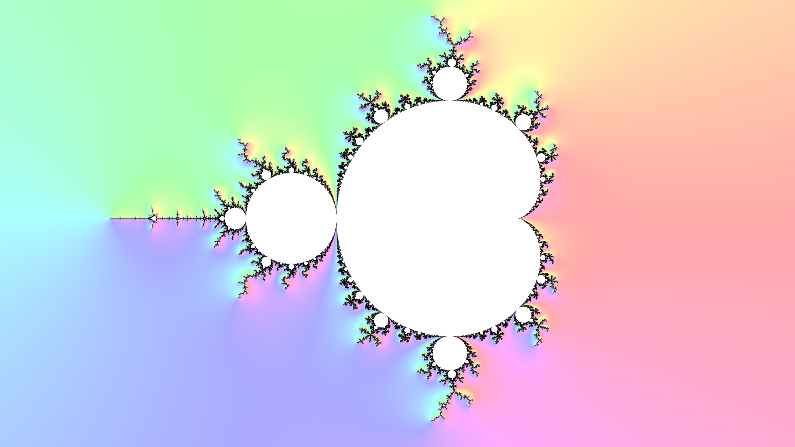
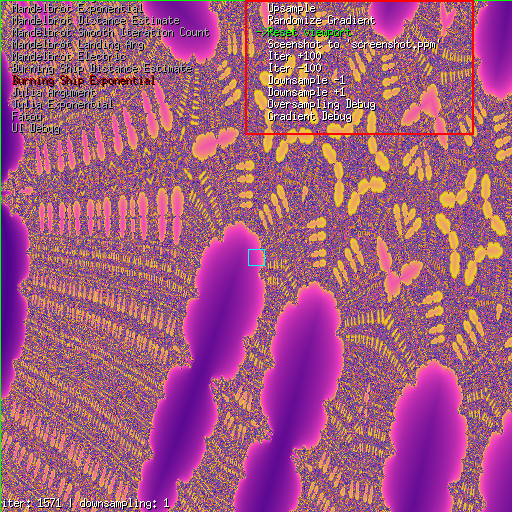
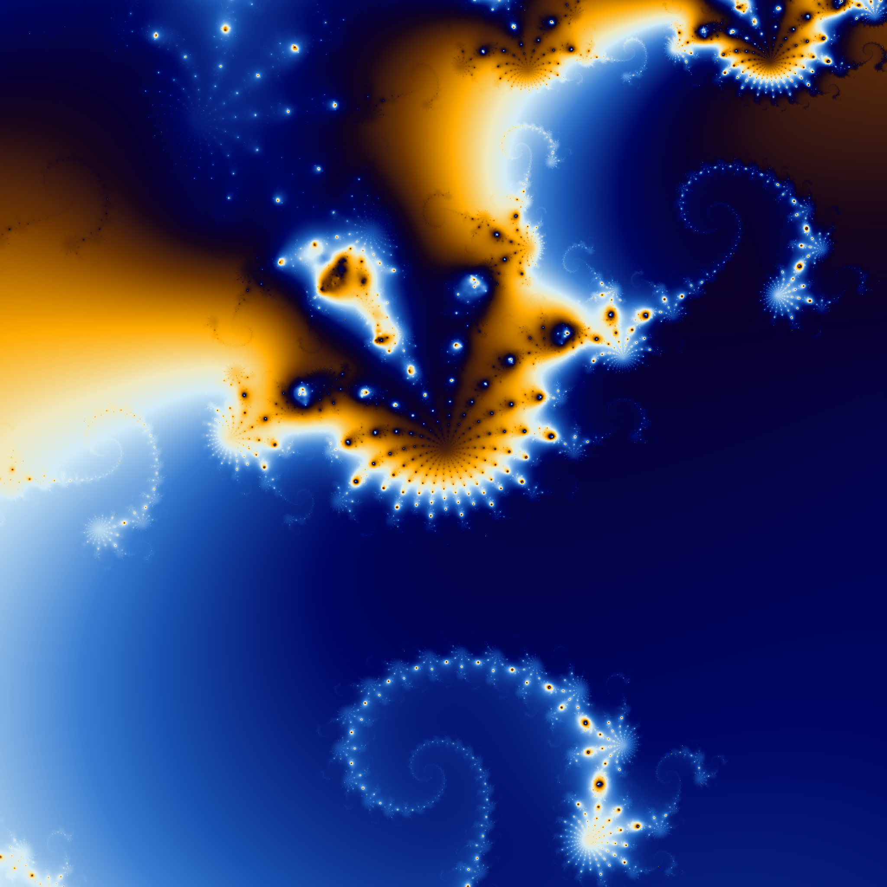
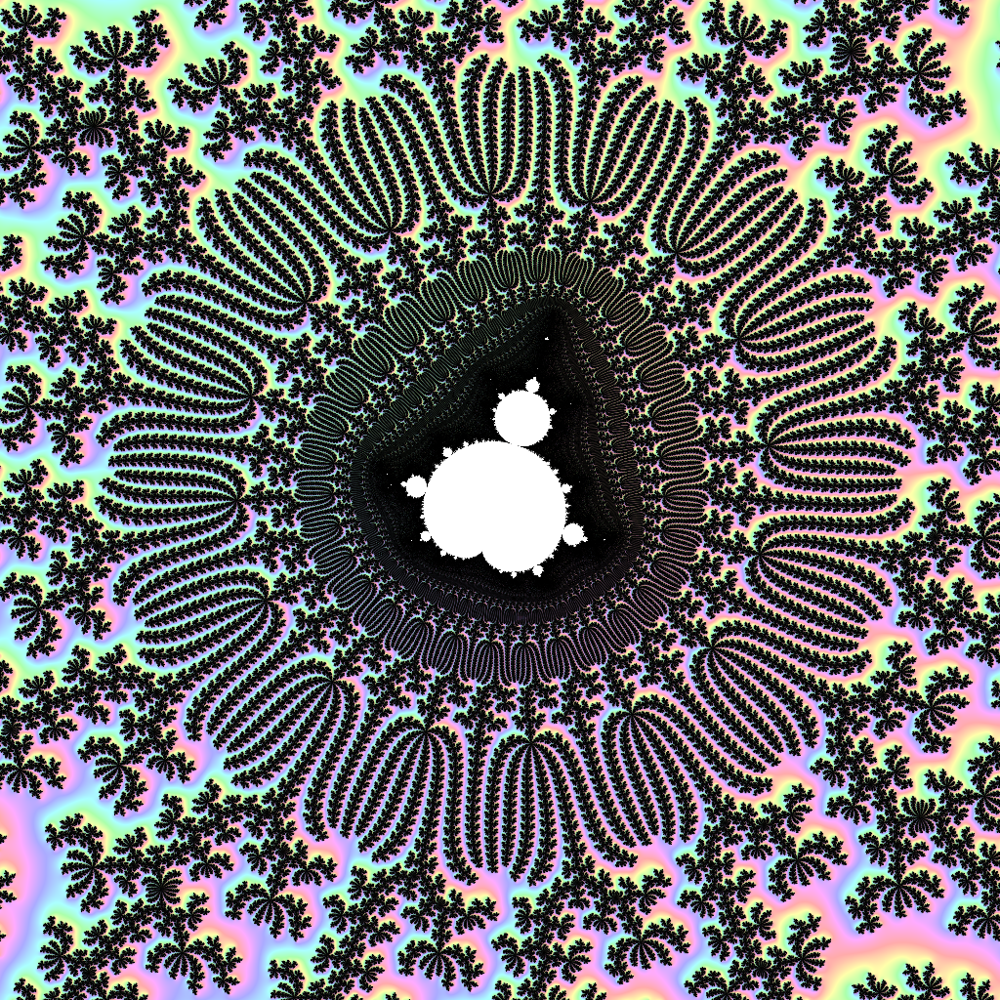
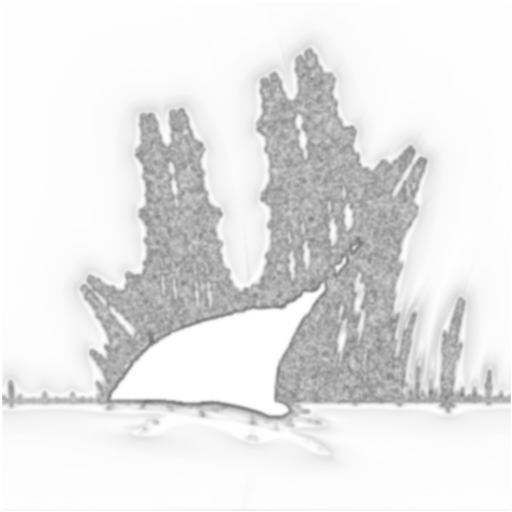
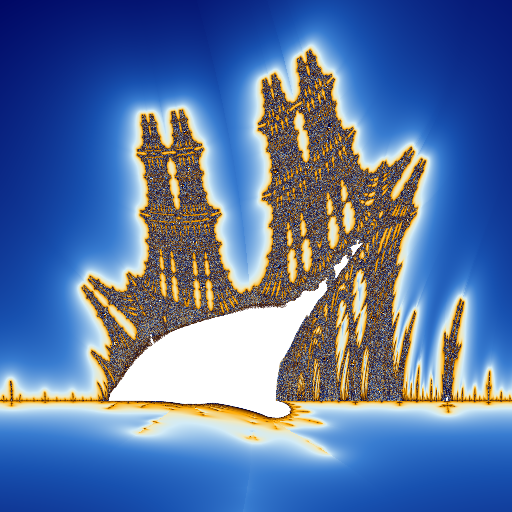
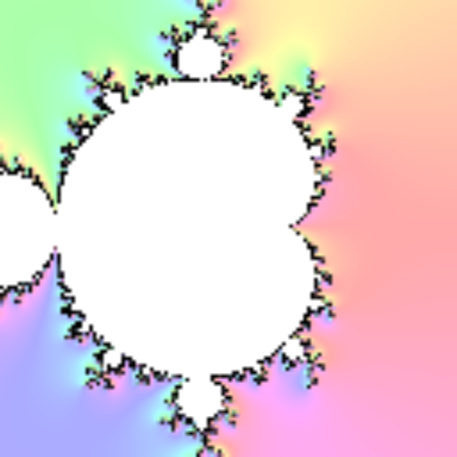
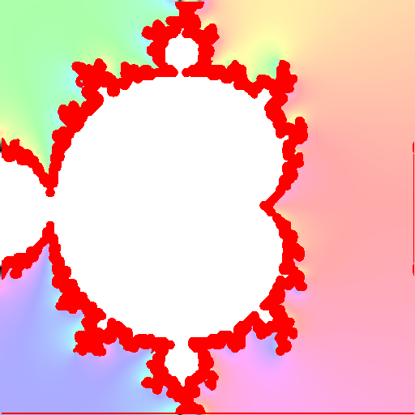
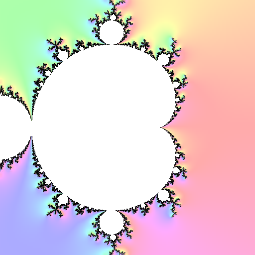
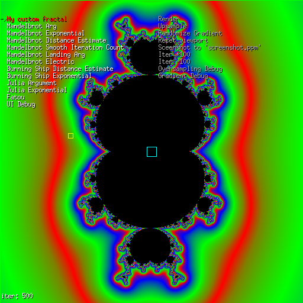

# Fractol -- Fractal explorer program



# Building

Fractol requires the following to be installed:
 - `libx11`
 - `libxext`
Optional requirements:
 - `openmp` (`libgomp` for gcc, `libomp` for clang)\
    *Required for multithreading, might have to turn off `-Werror` when building without it.*

Then you can run `make` to build the `fractol` executable. Or `make bonus` for the multithreaded (faster) version.

You can now run fractol: `./fractol 1024 1024`.

# Navigation

You can navigate using the mouse:
 * `Mouse wheel` for zooming
 * `Mouse left` to 'pan' the view

Or you can use the keyboard:
 * Numpad `+` or `-` for zooming
 * `Arrow keys` for moving
*Note: You have to disable the [S]elector in order to use arrow key navigation.*


## <a name="selector" style="text-decoration:none;">Selector ui</a>

The selector can be toggled by pressing key `S`, it is enabled by default.



The selector lets you navigate through rendering kernels and program options.
 * The selector can be toggled by pressing the **S** key.
 * Use the arrow keys to navigate entries in the selector.
 * Press `Enter` to select an option.

### Screenshot

To save the current render as a screenshot, choose the `Screenshot to 'screenshot.ppm'` option, or press key `Z`.
The image will be saved in [ppm](https://netpbm.sourceforge.net/doc/ppm.html) format.

You can convert a screenshot using imagemagick: `convert screenshot.ppm screenshot.png`.

# Rendering

The program uses two different rendering pipelines according to the value chosen for [`downsampling`](#opts-downsampling).

 * **When `downsampling == 1`: [Key = R]**
   - The image is rendered using 1 sample per screen pixel. The image is then displayed with no further processing.\
        *This is the default rendering method, note that some regions may require [upsampling](#render-upsampling) in order to display 'precisely'.*

 * **When `downsampling > 1`: [Key = R]**
    - The image is rendered to a buffer of sizes `(window_width / downsampling, window_height / downsampling)`.
    - The image is then upscaled using bilinear filtering.\
        *Doing so gives good result around 'smooth' regions in the smaller image.\
        However, 'noisy' regions become blurry when upscaled. Edge-detection can help to detect these regions\
        in order to 'fix' their blurryness.*
    - Edges are detected using [Sobel edge detection](https://en.wikipedia.org/wiki/Sobel_operator)
    - Detected edges are propagated to their neighbor pixels in order to create a 'mask' of blurry regions.
    - Each pixel present in the mask is re-sampled from the fractal in order to get a newer accurate reading of their values.\
        *A possible optimization to this method is to re-use the previously computed pixel data from the smaller image*\
        See [gallery](#gallery-downsampling) for how downsampling works.

 * **When using <a name="render-upsampling" style="text-decoration:none;">upsampling</a> (antialiasing): [Key = U]**
    - Sobel edge-detection is used to detect noisy regions that might need re-computing.
    - A 5x5 gaussian blur is used to 'propagate' noisy pixels to their neighbors.
    - From then, each pixel gets an oversampling weight assigned.\
        *The assigned weights can be visualized using `Oversampling debug` in the selector ui.*
    - Each pixel is recomputed using `(2 * floor(weight) + 1) ^ 2` samples.\
        *(The original pixel is subdivided into a grid with 1 cell for each sample)*
    - They are then blended into the final pixel value using gaussian sampling.\
        *This upsampling method can save a lot of resources, as most smooth pixel regions would have\
        stayed the same if they had been oversampled. Oversampling only the noisy regions uses\
        less resources than supersampling. While still providing good quality images.\
        However, expect very noisy images to result in global oversampling of the entire image (long).* \
        See [gallery](#gallery-upsampling) for examples of upsampling.

# Parameters

## Required parameters

The program requires two positional arguments, respectively `WIDTH` and `HEIGHT`.
They must be positive integers between 256 and 4096. These will be the window's default sizes.

**Example**
`./fractol 1280 780 # for a 1280x720 window`

## Additional parameters

The program support the following additional options:
 *  <a name="opts-downsampling" style="text-decoration:none;">**Downsampling**</a> `-d N | --downsample N`\
    *N=Integer value between 1 and 16, default: 1*\
    This value controls the downscaling factor for when rendering the image.
 * **Choosing a kernel** `--kernel ID`\
    *ID=Positive integer, default: 0*\
    This selects the default kernel used for rendering.
    This option can be changed inside the program via the [selector](#selector) ui.
 * **High quality antialiasing** `-o N | --oversampling N`\
    *N=Integer value between 1 and 8, default: 1*\
    Sets the oversampling factor to use when upsampling images.\
    The number of total samples per pixel will be multiplied by `N*N`\
    See [upsampling](#render-upsampling) for more information.

# Gallery

 [The julia exp galaxy kernel](./src/kernel/kernels/julia_exp_galaxy.c)

 [The mandel arg kernel over a minibrot](./src/kernel/kernels/mandel_arg.c)

## <a name="gallery-upsampling" style="text-decoration:none;">Upsampling</a>

\
Image rendered at 1 sample per pixel

\
Post processing mask generated for the image

\
Image after upsampling using processing mask

## <a name="gallery-downsampling" style="text-decoration:none;">Downsampling</a>

With `downsampling == 4`:

\
Upscaled (bilinear) downsampled 4x image

\
Mask for pixles needing resampling

\
Result once resampling has been applied

# Defining new fractals

You can add a new fractal by creating the following file: `src/kernel/kernels/my_fractal.c`.

**Template**
```c
// Iteration code
static inline t_color    iter(double complex c, const t_closure *data)
{
    int i;
    double m;
    double complex dz;
    double complex z;

    dz = 0;
    z = 0;
    i = 0;
    while (i < data->max_it)
    {
        // Derivative
        dz = 3 * z * z * dz + c;
        // Main function Z(n+1) = Z(n)^3 + c
        z = z * z * z + c;
        m = cabs(z);
        if (m > 1e8) // c is outside the set, color it...
        {
            m = 2 * log2(m) * m / cabs(dz);
            // Plot from gradient
            return (gradient_get(&data->settings->gradient, log10(m)));
        }
        ++i;
    }
    return ((t_color){0x000000});
}

// Render callback, called when the user asks for rendering
static inline void
    render(
            struct s_fragment_data *data,
            const t_kernel_settings *settings,
            const int max_it
            )
{
    struct s_kernel_closure closure;

    closure.view = data->viewport;
    closure.settings = settings;
    closure.max_it = max_it;
    // Call iteration code for each pixel
    viewport_fragment(data, (t_color (*)(double _Complex, void *))iter,
        &closure);
}

// Initialization function of your fractal.
// if `settings` is NULL, do not initialize anything!
const t_kernel    *my_fractal(t_kernel_settings *settings)
{
    // Red/Green/Blue gradient
    static const struct s_gr_color colors[] = {
    {{0xFF0000}, 1.0}, {{0x00FF00}, 1.0}, {{0x0000FF}, 1.0}};
    static const t_kernel kernel = {
        .name = "My custom fractal",
        .render = render,
        .default_viewport = {{-1.5, 1.5, -1.0, 1.0}}, // Viewable area, can be changed according to window's sizes
        .default_mat = {{1, 0, 0, 1}}, // Transformation
        .flags = USE_GRADIENT, // Flag because we use the gradient
        .default_color = {0x000000}, // Background color
    };

    if (settings)
        settings->gradient
            = gradient_new(colors, sizeof(colors) / sizeof(colors[0]));
    return (&kernel);
}
```

Don't forget to add your file to the kernel list in `./src/kernel/kernel.c` and to the makefile.


# License

This project is licensed under the GNU GPL version 3.
